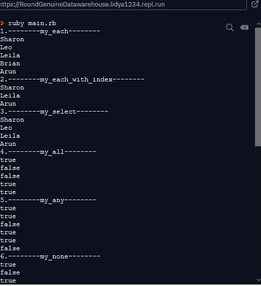
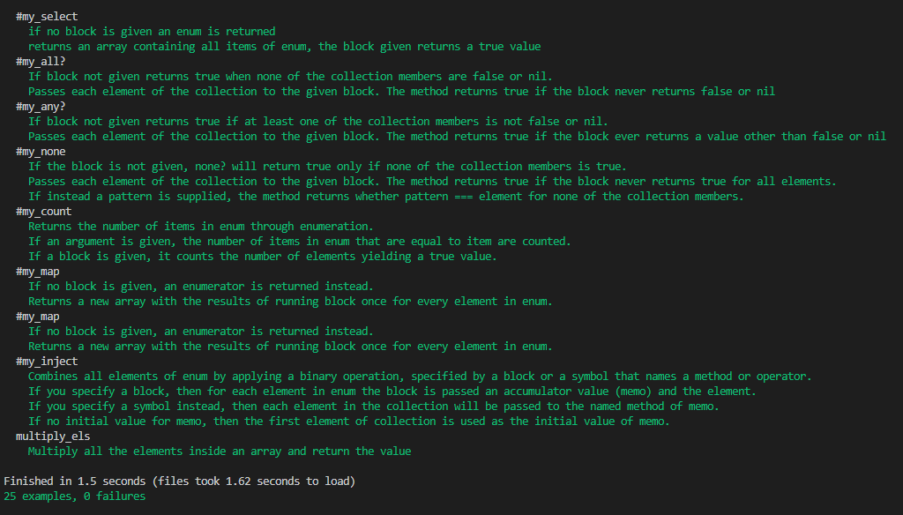

# Ruby Enumerables

Ruby Enumerables project
Enumerable Methods In this project
- my_each
- my_each_with_index
- my_select
- my_all?
- my_any?
- my_none?
- my_count
- my_map
- my_inject
- multiply_els

## Built With

- Ruby
- GIT
- VSCODE
- RSPEC

<h1>Getting Started</h1>

#To get a local copy up and running follow these simple example steps.
cd 

git clone  https://github.com/Lidya1234/Enumerable_method.git

## How to run tests
- cd 
- In command line editor write gem install rspec .
- You will find the enumerables_spec.rb in Enumerable_method/spec folder .
- To run it  in command line editor write  rspec spec/enumerables_spec.rb .
- Then it will display the results like what you see in the image below.

 

#Prerequisites
-Text editor
-Github profile
-Git and Ruby
-Rspec.

<h2>Authors</h2>

👤 Author1

- Github: [@Lidya-github ](https://github.com/Lidya1234)
- Twitter: [@Lidya-twitter](https://twitter.com/Lidya42676629)
- Linkedin: [Lidya-linkedin-link](https://www.linkedin.com/in/lidya-ghebreigziabher-4a94391aa/)

👤 Author2

- Github: [@Mina-github ](https://github.com/coldatlas)
- Twitter: [@Mina-twitter](https://twitter.com/coldyatlas)
- Linkedin: [Mina-linkedin-link](https://www.linkedin.com/in/coldyatlas/)

👤 Author3
- Github: [@Adewunmi97-github ](https://github.com/Adewunmi97)
- Twitter: [@ShonibareC-twitter](https://twitter.com/ShonibareC)

## 🤝 Contributing

 Contributions, issues and feature requests are welcome!

Feel free to check the issues page.

Show your support Give a ⭐️ if you like this project!

Acknowledgments Hat tip to anyone whose code was used Inspiration etc

📝 License This project is a collaboration project of microverse students. All rights are reserved for Lidya G and Mina Ibrahim.
